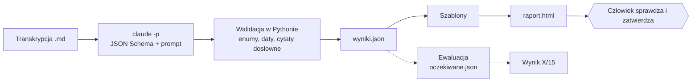

# Schemat procesu

```mermaid
flowchart LR
    T[Transkrypcja .md] --> C["claude -p<br/>JSON Schema + prompt"]
    C --> V["Walidacja w Pythonie<br/>enumy, daty, cytaty dosłowne"]
    V --> W[wyniki.json]
    W --> S[Szablony]
    S --> R[raport.html]
    R --> H{{Człowiek sprawdza i zatwierdza}}
    W -.-> E["Ewaluacja<br/>oczekiwane.json"]
    E -.-> O[Wynik X/15]
```

Szczegóły decyzji: `plan.md`.
